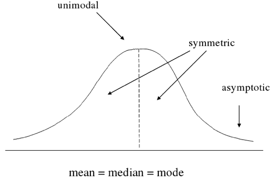
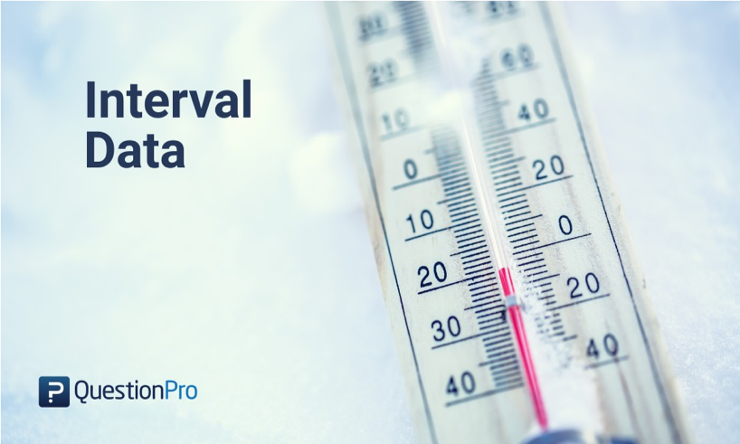

::::::::::::::::::::::::::::::::::::::: objectives

- To be able to describe the different types of data
- To be able to do basic data exploration of a real dataset
- To be able to calculate descriptive statistics
- To be able to perform statistical inference on a dataset

::::::::::::::::::::::::::::::::::::::::::::::::::

:::::::::::::::::::::::::::::::::::::::: questions

- How can I detect the type of data I have?
- How can I make meaningful summaries of my data?

::::::::::::::::::::::::::::::::::::::::::::::::::


```r
# Packages and data we'll use in this episode
library(tidyverse)
library(lubridate)
```

# Introduction

## Content

-   Types of Data
-   Exploring your dataset
-   Descriptive Statistics
-   Inferential Statistics

## Getting the data

In this episode, we will work with a subset of the [CCHIC](https://doi.org/10.1016/j.ijmedinf.2018.01.006)
dataset. You can load the data directly in your R session by running the following script.


```r
## Create a data folder
dir.create("data", showWarnings = FALSE) # `showWarnings = FALSE` avoids warning if the folder already exists
download.file(
    "https://raw.githubusercontent.com/UCL/ClinicianCoders/main/episodes/data/intermediate_CCHIC.csv",
    destfile = "data/intermediate_CCHIC.csv"
)
```

::::::::::::::::::::::::::::::::::::: instructor

- Help them load the dataset if needed. This is the same one they used in the morning. It should include the *length of stay* variable.
- Point out that these commands should be run only once, in the console
:::::::::::::::::::::::::::::::::::::::::::::::::

We can then load the data locally by running


```r
cchic <- read_csv("data/intermediate_CCHIC.csv")
```

```{.output}
Rows: 5000 Columns: 34
── Column specification ────────────────────────────────────────────────────────
Delimiter: ","
chr   (3): vital_status, sex, gender
dbl  (28): lactate_abg, ph_abg, hco3_abg, temp_c, temp_nc, urea, creatinine,...
dttm  (2): arrival_dttm, discharge_dttm
date  (1): dob

ℹ Use `spec()` to retrieve the full column specification for this data.
ℹ Specify the column types or set `show_col_types = FALSE` to quiet this message.
```


## The big picture

-   Research often seeks to answer a question about a larger population by collecting data on a small portion
-   Data collection:
    -   Many variables
    -   For each person/unit.
-   This procedure, *sampling*, must be controlled so as to ensure **representative** data.

## Descriptive and inferential statistics

::: Background
Just as data in general are of different types - for example numeric vs text data - statistical data are assigned to different *levels of measure* The level of measure determines how we can describe and model the data.
:::

# Data types

## Continuous

Continuous data is data that can take any value in the appropriate metric space. Examples are variables like *height* and *temperature*. Very often this is any point on the real number line. Ratio data are data that can form ratios, such that a score of seventy is twice a score of thirty five, and where the intervals between adjacent values is equal. Ratio level data also have a 'true' zero (the phenomenon measured is absent), rather than an arbitrary of calibrated zero (zero degrees Celsius is the freezing point of water.)

There is no limit in general to the mathematical operations we can carry out on continuous data.

::::::::::::::::::::::::::::::::::::: callout
Side Note It is worth noting that *interval* level data are often included as **continuous** since they can mostly be treated just like ratio data, aside from the calculation of the *coefficient of variation*, but by strict definition they are discrete.
:::::::::::::::::::::::::::::::::::::::::::::::::

## Discrete

Discrete data take their value from a closed set of possible values. There is no bound as to what the elements of the set may be - they can be integer values, fractional values, or entirely non-numeric.

Nominal data are data whose observation entails assigning them to a category from a collection of labelled categories. An example might be eye-colour. The only mathematical procedure we can use with nominal data is *counting* so as to report *frequency* of occurrence and from these frequencies, proportions. Thus the measure of location or of central location for nominal data is **the mode** and the only measure of variability or dispersion is **the variation ratio**.

Ordinal data are discrete data items that can be ranked. So, as well as counting items they can be **ordered**. The mode can almost always be calculated for ordinal data, but it may also be possible to calculate the **median** as an alternative measure of central location. Variability in ordinal data is indicated by **range** and **interquartile range**.

Interval

Interval data are numeric data that are ordered on a scale where the distance between measuring points is equal. Unlike ratio data, the zero point on an interval scale is an arbitrarily chosen calibration and data measurements do not form ratios.

# Continuous variables

-   e.g. age, height, weight
-   Have distributions:
    -   Gaussian
    -   Poisson
    -   Binomial
    -   Cauchy/Lorenz
-   Can't be described


## What is normally distributed data?




# Discrete variables

## Types of discrete variables

### Nominal

-   e.g. hair colour, types of antibiotics
-   There is no order between the data types (e.g. blonde, brunette, red hair)

### Ordinal

-   There is an order e.g. `care_level` where Level 3 \> Level 2 \> Level 1 etc.
-   However, the difference between Level 1 and Level 2 critical care may not be the same as the difference between Level 2 and Level 3.
    


### Interval

-   There is an order to data points (e.g. `age_cat` for age centile) and the difference between these points are equal (e.g. 10 years)
    


# Describing data

-   Continuous variables
-   Discrete variables

::: callout
How do we convey information on what your data looks like, using numbers or figures?
:::

## Describing continuous data

First establish the distribution of the data. You can visualise this with a histogram.


```r
ggplot(cchic, aes(x = age_years)) +
  geom_histogram()
```

What is the distribution of this data?


### What is the distribution of height?

Try this command


```r
ggplot(data = cchic, aes(x = height)) +
  geom_histogram()
```

What is the distribution of this data?


### Parametric vs non-parametric analysis

-   Parametric analysis assumes that
    -   The data follows a known distribution
    -   It can be described using *parameters*
    -   Examples of distributions include, normal, Poisson, exponential.
-   Non parametric data
    -   The data can't be said to follow a known distribution

::::::::::::::::::::::::::::::::::::: instructor
Emphasise that parametric is not equal to normal.
::::::::::::::::::::::::::::::::::::::::::::::::

#### Describing parametric and non-parametric data

How do you use numbers to convey what your data looks like.

-   Parametric data
    -   Use the parameters that describe the distribution.
    -   For a Gaussian (normal) distribution - use mean and standard deviation
    -   For a Poisson distribution - use average event rate
    -   etc.
-   Non Parametric data
    -   Use the median (the middle number when they are ranked from lowest to highest) and the interquartile range (the number 75% of the way up the list when ranked minus the number 25% of the way)
-   You can use the command `summary(data_frame_name)` to get these numbers for each variable.

#### Mean and standard deviation

-   What does standard deviation mean?
-   Both graphs have the same mean (center), but the second one has data which is more spread out.


```r
# small standard deviation
dummy_1 <- rnorm(1000, mean = 10, sd = 0.5)
dummy_1 <- as.data.frame(dummy_1)
ggplot(dummy_1, aes(x = dummy_1)) +
  geom_histogram()

# larger standard deviation
dummy_2 <- rnorm(1000, mean = 10, sd = 20)
dummy_2 <- as.data.frame(dummy_2)
ggplot(dummy_2, aes(x = dummy_2)) +
  geom_histogram()
```

::::::::::::::::::::::::::::::::::::: instructor
Get them to plot the graphs. Explain that we are generating random data from different distributions and plotting them.
::::::::::::::::::::::::::::::::::::::::::::::::

##### Calculating mean and standard deviation


```r
mean(cchic$height, na.rm = TRUE)
```

```{.output}
[1] 1.68634
```

Calculate the standard deviation and confirm that it is the square root of the variance:


```r
sdheight = sd(cchic$height, na.rm = TRUE)

varheight = var(cchic$height, na.rm = TRUE)

sqrt(varheight) == sdheight
```

```{.output}
[1] TRUE
```

The `na.rm` argument tells R to ignore missing values in the variable.

#### Mean and interquartile range


```r
median(cchic$age_years, na.rm = TRUE)
```

```{.output}
[1] 60
```


```r
IQR(cchic$age_years, na.rm = TRUE)
```

```{.output}
[1] 20
```

Again, we ignore the missing values.

## Describing discrete data

-   Frequencies


```r
table(cchic$vital_status)
```

```{.output}

   A    D 
4444  556 
```

-   Proportions


```r
status <- table(cchic$vital_status)
prop.table(status)
```

```{.output}

     A      D 
0.8888 0.1112 
```

Contingency tables of frequencies can also be tabulated with **table()**. For example:


```r
table(cchic$vital_status, cchic$chemo)
```

```{.output}
   
       0    1
  A 2646 1798
  D  317  239
```

Which leads quite naturally to the consideration of any association between the observed frequencies.

# Inferential statistics

## Meaningful analysis

-   What is your hypothesis - what is your null hypothesis?

::: callout
Always: the level of the independent variable has no effect on the level of the dependent variable.
:::

-   What type of variables (data type) do you have?

-   What are the assumptions of the test you are using?

-   Interpreting the result

## What is a p-value?


[The Lady Tasting Tea](https://analyticalsciencejournals.onlinelibrary.wiley.com/doi/10.1002/cem.3239)

Fisher informally characterised the *p-value* as an estimate of the strength of the evidence against the null hypothesis [^1] (Dahiru T. (2008). P - value, a true test of statistical significance? A cautionary note. Annals of Ibadan postgraduate medicine, 6(1), 21--26. <https://doi.org/10.4314/aipm.v6i1.64038>)

[^1]: Dahiru T. (2008). P - value, a true test of statistical significance? A cautionary note. *Annals of Ibadan postgraduate medicine*, *6*(1), 21--26. <https://doi.org/10.4314/aipm.v6i1.64038>

Depending on the data under consideration and our purpose, we choose a threshold of evidence for the rejection of the null hypothesis. For many purposes, a confidence level of 95% is chosen, which means that a p-value of less than 0.05 is sufficient to reject the null hypothesis. In other circumstances and confidence level of 99% may be appropriate, or even higher.

::: callout
**What we are usually hoping for...**


:::

## Testing significance

-   p-value

-   \<0.05

-   0.03-0.049

    -   Would benefit from further testing.

**0.05** is not a magic number.

### Comparing means

It all starts with a hypothesis

-   Null hypothesis
    -   "There is no difference in mean height between men and women" $$mean\_height\_men - mean\_height\_women = 0$$
-   Alternate hypothesis
    -   "There is a difference in mean height between men and women"

### More on hypothesis testing

-   The null hypothesis (H0) assumes that the true mean difference (μd) is equal to zero.

-   The two-tailed alternative hypothesis (H1) assumes that μd is not equal to zero.

-   The upper-tailed alternative hypothesis (H1) assumes that μd is greater than zero.

-   The lower-tailed alternative hypothesis (H1) assumes that μd is less than zero.

-   Remember: hypotheses are never about data, they are about the processes which produce the data. The value of μd is unknown. The goal of hypothesis testing is to determine the hypothesis (null or alternative) with which the data are more consistent.

## Comparing means

Is there an absolute difference between the heights of males and females?


```r
cchic %>%
  group_by(sex) %>%
  summarise(av.height = mean(height, na.rm = TRUE))
```

```{.output}
# A tibble: 2 × 2
  sex   av.height
  <chr>     <dbl>
1 F          1.62
2 M          1.74
```

Is the difference between heights statistically significant?

### t-test

-   Compares means between two populations
-   Paired vs. Unpaired


#### Assumptions of a t-test

-   One independent categorical variable with 2 groups and one dependent continuous variable

-   The dependent variable is approximately normally distributed in each group

-   The observations are independent of each other

-   For students' original t-statistic, that the variances in both groups are more or less equal. This constraint should probably be abandoned in favour of always using a conservative test.

#### Doing a t-test


```r
t.test(height ~ sex, data = cchic)
```

::::::::::::::::::::::::::::::::::::: instructor
Tell them to do this. The default for t.test() is that variances are unequal and it produces Welch's statistic.
::::::::::::::::::::::::::::::::::::::::::::::::


```{.output}

	Welch Two Sample t-test

data:  height by sex
t = -53.367, df = 4925.5, p-value < 2.2e-16
alternative hypothesis: true difference in means between group F and group M is not equal to 0
95 percent confidence interval:
 -0.1263508 -0.1173967
sample estimates:
mean in group F mean in group M 
       1.619212        1.741086 
```

::::::::::::::::::::::::::::::::::::: instructor
Quickly explain the main points of the output
::::::::::::::::::::::::::::::::::::::::::::::::

## Comparing counts

-   Is survival different between genders?


```r
table(cchic$sex, cchic$vital_status)
```

```{.output}
   
       A    D
  F 1986  260
  M 2458  296
```

### What is our hypothesis?

-   Null hypothesis
    -   There is no difference in survival between men and women
-   Alternate hypothesis
    -   There is a difference in survival between men and women

### Assumptions of the chi-squared test.

1.  Data in cells should be frequencies or counts *not* percentages
2.  Levels/Categories are mutually exclusive -- here being a alive/dead applies
3.  Each subject contributes to one cell -- can either be male/female and alive/dead
4.  Independent study groups
5.  2 categorical variables
6.  Expected values in no more than 20% of cells are \< 5

`Biochem Med (Zagreb). 2013 Jun; 23(2): 143–149.`

### Doing the chi-squared test.

Start with `?chisq.test`. Then do the test.


```r
x <- chisq.test(cchic$sex, cchic$vital_status)
summary(x)
```

```{.output}
          Length Class  Mode     
statistic 1      -none- numeric  
parameter 1      -none- numeric  
p.value   1      -none- numeric  
method    1      -none- character
data.name 1      -none- character
observed  4      table  numeric  
expected  4      -none- numeric  
residuals 4      table  numeric  
stdres    4      table  numeric  
```

::::::::::::::::::::::::::::::::::::: instructor
(important as it holds for results of all statistical tests) Get them to do this, then explain the output. Do the same test, assigning the result to a data object and explain how to access the contents of the data object to show, df, expected values, residuals etc.
::::::::::::::::::::::::::::::::::::::::::::::::

## Non-parametric versions

Is length of stay different between genders?


```r
ggplot(data = cchic, aes(x = los)) +
  geom_histogram() +
  facet_grid(~sex)
```


### When do you use a non-parametric test?

-   When any of the the following are true.
    -   Level of measurement is nominal or ordinal
    -   Unequal sample sizes
    -   Skewed data
    -   Unequal variance
    -   Continuous data collapsed into small number of categories

### Using the Mann-Whitney test

`??Mann-Whitney` will show you that the command is actually called `wilcox.test`.


```r
wilcox.test(los ~ sex, data = cchic)
```

```{.output}

	Wilcoxon rank sum test with continuity correction

data:  los by sex
W = 3104046, p-value = 0.8218
alternative hypothesis: true location shift is not equal to 0
```

::::::::::::::::::::::::::::::::::::: instructor
Explain the output
::::::::::::::::::::::::::::::::::::::::::::::::

## More than two levels of IV

While the t-test is sufficient where there are two levels of the IV, for situations where there are more than two, we use the **ANOVA** family of procedures. To show this, we will create a variable that subsets our data by *creatinine* levels. If the ANOVA result is statistically significant, we will use a post-hoc test method to do pairwise comparisons (here Tukey's Honest Significant Differences.)


```r
quantile(cchic$creatinine)
```

```{.output}
  0%  25%  50%  75% 100% 
  15   64   83  123 1533 
```

```r
IQR(cchic$creatinine)
```

```{.output}
[1] 59
```

```r
cchic$creatininegroup <- cut(cchic$creatinine, breaks = c(15, 64, 83, 123, 1533), labels = FALSE)

# cchic %>%
#  mutate(creatininegroup = cut(cchic$creatinine, breaks=c(15, 64, 83, 123,1533), labels = FALSE))

cchic$creatininegroup <- factor(cchic$creatininegroup)

anovamodel <- aov(cchic$ph_abg ~ cchic$creatininegroup)
summary(anovamodel)
```

```{.output}
                        Df Sum Sq Mean Sq F value Pr(>F)    
cchic$creatininegroup    3   1.01  0.3369    44.8 <2e-16 ***
Residuals             4990  37.53  0.0075                   
---
Signif. codes:  0 '***' 0.001 '**' 0.01 '*' 0.05 '.' 0.1 ' ' 1
6 observations deleted due to missingness
```

```r
TukeyHSD(anovamodel)
```

```{.output}
  Tukey multiple comparisons of means
    95% family-wise confidence level

Fit: aov(formula = cchic$ph_abg ~ cchic$creatininegroup)

$`cchic$creatininegroup`
            diff         lwr           upr     p adj
2-1 -0.008546113 -0.01740952  0.0003172957 0.0635102
3-1 -0.020044485 -0.02890789 -0.0111810756 0.0000000
4-1 -0.037847402 -0.04669787 -0.0289969345 0.0000000
3-2 -0.011498371 -0.02049214 -0.0025045984 0.0056529
4-2 -0.029301289 -0.03828231 -0.0203202694 0.0000000
4-3 -0.017802918 -0.02678394 -0.0088218981 0.0000022
```

## Regression Modelling

The most common use of regression modelling is to explore the relationship between two continuous variables, for example between `temp_c` and `temp_nc` in our data. We can first determine whether there is any significant correlation between the values, and if there is, plot the relationship.


```r
cor.test(cchic$temp_c, cchic$temp_nc)
```

```{.output}

	Pearson's product-moment correlation

data:  cchic$temp_c and cchic$temp_nc
t = 15.973, df = 4998, p-value < 2.2e-16
alternative hypothesis: true correlation is not equal to 0
95 percent confidence interval:
 0.1938446 0.2465926
sample estimates:
      cor 
0.2203797 
```

```r
ggplot(cchic, aes(temp_c, temp_nc)) +
  geom_point() +
  geom_smooth(method = "lm")
```

```{.output}
`geom_smooth()` using formula = 'y ~ x'
```


Having decided that a further investigation of this relationship is worthwhile, we can create a linear model with the function `lm()`


```r
modelone <- lm(cchic$temp_nc ~ cchic$temp_c)
summary(modelone)
```

```{.output}

Call:
lm(formula = cchic$temp_nc ~ cchic$temp_c)

Residuals:
     Min       1Q   Median       3Q      Max 
-13.3105  -0.3508   0.1707   0.6464   4.6472 

Coefficients:
             Estimate Std. Error t value Pr(>|t|)    
(Intercept)  22.62677    0.86066   26.29   <2e-16 ***
cchic$temp_c  0.37845    0.02369   15.97   <2e-16 ***
---
Signif. codes:  0 '***' 0.001 '**' 0.01 '*' 0.05 '.' 0.1 ' ' 1

Residual standard error: 1.688 on 4998 degrees of freedom
Multiple R-squared:  0.04857,	Adjusted R-squared:  0.04838 
F-statistic: 255.1 on 1 and 4998 DF,  p-value: < 2.2e-16
```

### Regression with a categorical IV (the t-test)

Run the following code chunk and compare the results to the t test conducted earlier.


```r
cchic %>%
  mutate(sex = factor(sex))
```

```{.output}
# A tibble: 5,000 × 35
   lactate_abg ph_abg hco3_abg temp_c temp_nc  urea creatinine sodium     k
         <dbl>  <dbl>    <dbl>  <dbl>   <dbl> <dbl>      <dbl>  <dbl> <dbl>
 1         1.2   7.44     28     36.9    37.1   3           80    135   4.2
 2         1.8   7.3      20.2   36.6    36.4   5.8         93    140   4.4
 3         1.4   7.48     24.6   37.2    36.2   4.5         75    140   3.8
 4         1.5   7.33     22.3   35.4    35.8  13.7        173    136   5  
 5         0.7   7.21     20     35.9    37.1   7.9        186    140   4.9
 6         2.6   7.5      25.3   36.1    35.6   8.9         81    138   4.2
 7         3     7.29     19.5   35.6    38.3  12.5         55    138   5  
 8         1.2   7.4      23.1   35.9    36.1   9.4        251    138   5.8
 9         1.6   7.36     24     35.9    36.6  12.9        390    134   6.5
10         1.4   7.43     22     36.6    37.3   5.1         56    139   4.6
# ℹ 4,990 more rows
# ℹ 26 more variables: hb <dbl>, wbc <dbl>, neutrophil <dbl>, platelets <dbl>,
#   crp <dbl>, chemo <dbl>, chronic_rrt <dbl>, metastatic <dbl>, radiotx <dbl>,
#   apache <dbl>, medical <dbl>, system <dbl>, height <dbl>, weight <dbl>,
#   elective_surgical <dbl>, arrival_dttm <dttm>, discharge_dttm <dttm>,
#   dob <date>, vital_status <chr>, sex <fct>, nhs_number <dbl>,
#   age_years <dbl>, los <dbl>, bmi <dbl>, gender <chr>, …
```

```r
modelttest <- lm(cchic$height ~ cchic$sex)

summary(modelttest)
```

```{.output}

Call:
lm(formula = cchic$height ~ cchic$sex)

Residuals:
      Min        1Q    Median        3Q       Max 
-0.291086 -0.041086  0.008914  0.058914  0.280788 

Coefficients:
            Estimate Std. Error t value Pr(>|t|)    
(Intercept) 1.619212   0.001709  947.38   <2e-16 ***
cchic$sexM  0.121874   0.002303   52.92   <2e-16 ***
---
Signif. codes:  0 '***' 0.001 '**' 0.01 '*' 0.05 '.' 0.1 ' ' 1

Residual standard error: 0.081 on 4998 degrees of freedom
Multiple R-squared:  0.3591,	Adjusted R-squared:  0.359 
F-statistic:  2801 on 1 and 4998 DF,  p-value: < 2.2e-16
```

### Regression with a categorical IV (ANOVA)

Use the `lm()` function to model the relationship between `cchic$creatininegroup` and `cchic$ph_abg`.  Compare the results with the ANOVA carried out earlier.
