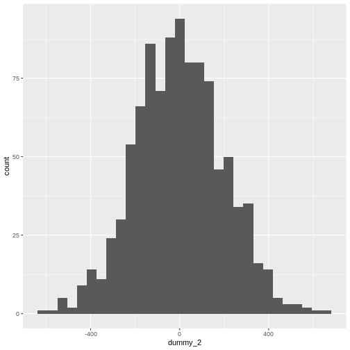
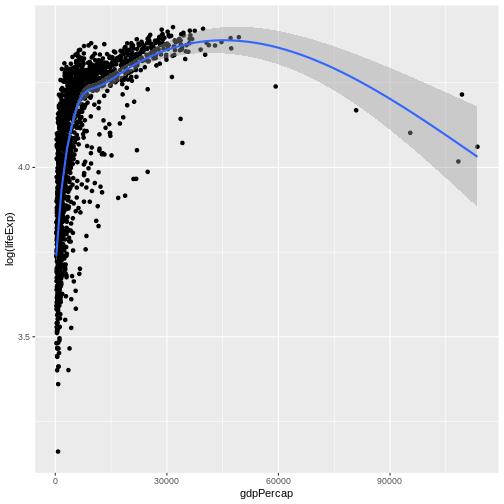

::::::::::::::::::::::::::::::::::::::: objectives

- To be able to describe the different types of data
- To be able to do basic data exploration of a real dataset
- To be able to calculate descriptive statistics
- To be able to perform statistical inference on a dataset

::::::::::::::::::::::::::::::::::::::::::::::::::

:::::::::::::::::::::::::::::::::::::::: questions

- How can I detect the type of data I have?
- How can I make meaningful summaries of my data?

::::::::::::::::::::::::::::::::::::::::::::::::::

## Content

-   Types of Data
-   Exploring your dataset
-   Descriptive Statistics
-   Inferential Statistics

## Data


``` r
# We will need these libraries and this data later.
library(tidyverse)
library(lubridate)
library(gapminder)
# create a binary membership variable for europe (for later examples)
gapminder <- gapminder %>%
  mutate(european = continent == "Europe")
```

We are going to use the data from the gapminder package.  We have added a variable *European* indicating if a country is in Europe.

## The big picture

-   Research often seeks to answer a question about a larger population by collecting data on a small sample
-   Data collection:
    -   Many variables
    -   For each person/unit.
-   This procedure, *sampling*, must be controlled so as to ensure **representative** data.

## Descriptive and inferential statistics

::: Background
Just as data in general are of different types - for example numeric vs text data - statistical data are assigned to different *levels of measure*. The level of measure determines how we can describe and model the data.
:::

# Describing data

-   Continuous variables
-   Discrete variables

::: callout
How do we convey information on what your data looks like, using numbers or figures?
:::

### Describing continuous data.

First establish the distribution of the data. You can visualise this with a histogram.


``` r
ggplot(gapminder, aes(x = gdpPercap)) +
  geom_histogram()
```

``` output
`stat_bin()` using `bins = 30`. Pick better value with `binwidth`.
```


What is the distribution of this data?

### What is the distribution of population?

The raw values are difficult to visualise, so we can take the log of the values and log those.  Try this command


``` r
ggplot(data = gapminder, aes(log(pop))) +
  geom_histogram()
```

``` output
`stat_bin()` using `bins = 30`. Pick better value with `binwidth`.
```


What is the distribution of this data?

## Parametric vs non-parametric analysis

-   Parametric analysis assumes that
    -   The data follows a known distribution
    -   It can be described using *parameters*
    -   Examples of distributions include, normal, Poisson, exponential.
-   Non parametric data
    -   The data can't be said to follow a known distribution

::::::::::::::::::::::::::::::::::::: instructor
Emphasise that parametric is not equal to normal.
::::::::::::::::::::::::::::::::::::::::::::::::

### Describing parametric and non-parametric data

How do you use numbers to convey what your data looks like.

-   Parametric data
    -   Use the parameters that describe the distribution.
    -   For a Gaussian (normal) distribution - use mean and standard deviation
    -   For a Poisson distribution - use average event rate
    -   etc.
-   Non Parametric data
    -   Use the median (the middle number when they are ranked from lowest to highest) and the interquartile range (the number 75% of the way up the list when ranked minus the number 25% of the way)
-   You can use the command `summary(data_frame_name)` to get these numbers for each variable.

## Mean versus standard deviation

-   What does standard deviation mean?
-   Both graphs have the same mean (center), but the second one has data which is more spread out.


``` r
# small standard deviation
dummy_1 <- rnorm(1000, mean = 10, sd = 0.5)
dummy_1 <- as.data.frame(dummy_1)
ggplot(dummy_1, aes(x = dummy_1)) +
  geom_histogram()
```

``` output
`stat_bin()` using `bins = 30`. Pick better value with `binwidth`.
```


``` r
# larger standard deviation
dummy_2 <- rnorm(1000, mean = 10, sd = 200)
dummy_2 <- as.data.frame(dummy_2)
ggplot(dummy_2, aes(x = dummy_2)) +
  geom_histogram()
```

``` output
`stat_bin()` using `bins = 30`. Pick better value with `binwidth`.
```



::::::::::::::::::::::::::::::::::::: instructor
Get them to plot the graphs. Explain that we are generating random data from different distributions and plotting them.
::::::::::::::::::::::::::::::::::::::::::::::::

### Calculating mean and standard deviation


``` r
mean(gapminder$pop, na.rm = TRUE)
```

``` output
[1] 29601212
```

Calculate the standard deviation and confirm that it is the square root of the variance:


``` r
sdpopulation <- sd(gapminder$pop, na.rm = TRUE)
print(sdpopulation)
```

``` output
[1] 106157897
```

``` r
varpopulation <- var(gapminder$pop, na.rm = TRUE)
print(varpopulation)
```

``` output
[1] 1.12695e+16
```

``` r
sqrt(varpopulation) == sdpopulation
```

``` output
[1] TRUE
```

The `na.rm` argument tells R to ignore missing values in the variable.

### Calculating median and interquartile range


``` r
median(gapminder$pop, na.rm = TRUE)
```

``` output
[1] 7023596
```


``` r
IQR(gapminder$gdpPercap, na.rm = TRUE)
```

``` output
[1] 8123.402
```

Again, we ignore the missing values.

## Describing discrete data

-   Frequencies


``` r
table(gapminder$continent)
```

``` output

  Africa Americas     Asia   Europe  Oceania 
     624      300      396      360       24 
```

-   Proportions


``` r
continenttable <- table(gapminder$continent)
prop.table(continenttable)
```

``` output

    Africa   Americas       Asia     Europe    Oceania 
0.36619718 0.17605634 0.23239437 0.21126761 0.01408451 
```

Contingency tables of frequencies can also be tabulated with **table()**. For example:


``` r
table(
    gapminder$country[gapminder$year == 2007],
    gapminder$continent[gapminder$year == 2007]
)
```

``` output
                          
                           Africa Americas Asia Europe Oceania
  Afghanistan                   0        0    1      0       0
  Albania                       0        0    0      1       0
  Algeria                       1        0    0      0       0
  Angola                        1        0    0      0       0
  Argentina                     0        1    0      0       0
  Australia                     0        0    0      0       1
  Austria                       0        0    0      1       0
  Bahrain                       0        0    1      0       0
  Bangladesh                    0        0    1      0       0
  Belgium                       0        0    0      1       0
  Benin                         1        0    0      0       0
  Bolivia                       0        1    0      0       0
  Bosnia and Herzegovina        0        0    0      1       0
  Botswana                      1        0    0      0       0
  Brazil                        0        1    0      0       0
  Bulgaria                      0        0    0      1       0
  Burkina Faso                  1        0    0      0       0
  Burundi                       1        0    0      0       0
  Cambodia                      0        0    1      0       0
  Cameroon                      1        0    0      0       0
  Canada                        0        1    0      0       0
  Central African Republic      1        0    0      0       0
  Chad                          1        0    0      0       0
  Chile                         0        1    0      0       0
  China                         0        0    1      0       0
  Colombia                      0        1    0      0       0
  Comoros                       1        0    0      0       0
  Congo, Dem. Rep.              1        0    0      0       0
  Congo, Rep.                   1        0    0      0       0
  Costa Rica                    0        1    0      0       0
  Cote d'Ivoire                 1        0    0      0       0
  Croatia                       0        0    0      1       0
  Cuba                          0        1    0      0       0
  Czech Republic                0        0    0      1       0
  Denmark                       0        0    0      1       0
  Djibouti                      1        0    0      0       0
  Dominican Republic            0        1    0      0       0
  Ecuador                       0        1    0      0       0
  Egypt                         1        0    0      0       0
  El Salvador                   0        1    0      0       0
  Equatorial Guinea             1        0    0      0       0
  Eritrea                       1        0    0      0       0
  Ethiopia                      1        0    0      0       0
  Finland                       0        0    0      1       0
  France                        0        0    0      1       0
  Gabon                         1        0    0      0       0
  Gambia                        1        0    0      0       0
  Germany                       0        0    0      1       0
  Ghana                         1        0    0      0       0
  Greece                        0        0    0      1       0
  Guatemala                     0        1    0      0       0
  Guinea                        1        0    0      0       0
  Guinea-Bissau                 1        0    0      0       0
  Haiti                         0        1    0      0       0
  Honduras                      0        1    0      0       0
  Hong Kong, China              0        0    1      0       0
  Hungary                       0        0    0      1       0
  Iceland                       0        0    0      1       0
  India                         0        0    1      0       0
  Indonesia                     0        0    1      0       0
  Iran                          0        0    1      0       0
  Iraq                          0        0    1      0       0
  Ireland                       0        0    0      1       0
  Israel                        0        0    1      0       0
  Italy                         0        0    0      1       0
  Jamaica                       0        1    0      0       0
  Japan                         0        0    1      0       0
  Jordan                        0        0    1      0       0
  Kenya                         1        0    0      0       0
  Korea, Dem. Rep.              0        0    1      0       0
  Korea, Rep.                   0        0    1      0       0
  Kuwait                        0        0    1      0       0
  Lebanon                       0        0    1      0       0
  Lesotho                       1        0    0      0       0
  Liberia                       1        0    0      0       0
  Libya                         1        0    0      0       0
  Madagascar                    1        0    0      0       0
  Malawi                        1        0    0      0       0
  Malaysia                      0        0    1      0       0
  Mali                          1        0    0      0       0
  Mauritania                    1        0    0      0       0
  Mauritius                     1        0    0      0       0
  Mexico                        0        1    0      0       0
  Mongolia                      0        0    1      0       0
  Montenegro                    0        0    0      1       0
  Morocco                       1        0    0      0       0
  Mozambique                    1        0    0      0       0
  Myanmar                       0        0    1      0       0
  Namibia                       1        0    0      0       0
  Nepal                         0        0    1      0       0
  Netherlands                   0        0    0      1       0
  New Zealand                   0        0    0      0       1
  Nicaragua                     0        1    0      0       0
  Niger                         1        0    0      0       0
  Nigeria                       1        0    0      0       0
  Norway                        0        0    0      1       0
  Oman                          0        0    1      0       0
  Pakistan                      0        0    1      0       0
  Panama                        0        1    0      0       0
  Paraguay                      0        1    0      0       0
  Peru                          0        1    0      0       0
  Philippines                   0        0    1      0       0
  Poland                        0        0    0      1       0
  Portugal                      0        0    0      1       0
  Puerto Rico                   0        1    0      0       0
  Reunion                       1        0    0      0       0
  Romania                       0        0    0      1       0
  Rwanda                        1        0    0      0       0
  Sao Tome and Principe         1        0    0      0       0
  Saudi Arabia                  0        0    1      0       0
  Senegal                       1        0    0      0       0
  Serbia                        0        0    0      1       0
  Sierra Leone                  1        0    0      0       0
  Singapore                     0        0    1      0       0
  Slovak Republic               0        0    0      1       0
  Slovenia                      0        0    0      1       0
  Somalia                       1        0    0      0       0
  South Africa                  1        0    0      0       0
  Spain                         0        0    0      1       0
  Sri Lanka                     0        0    1      0       0
  Sudan                         1        0    0      0       0
  Swaziland                     1        0    0      0       0
  Sweden                        0        0    0      1       0
  Switzerland                   0        0    0      1       0
  Syria                         0        0    1      0       0
  Taiwan                        0        0    1      0       0
  Tanzania                      1        0    0      0       0
  Thailand                      0        0    1      0       0
  Togo                          1        0    0      0       0
  Trinidad and Tobago           0        1    0      0       0
  Tunisia                       1        0    0      0       0
  Turkey                        0        0    0      1       0
  Uganda                        1        0    0      0       0
  United Kingdom                0        0    0      1       0
  United States                 0        1    0      0       0
  Uruguay                       0        1    0      0       0
  Venezuela                     0        1    0      0       0
  Vietnam                       0        0    1      0       0
  West Bank and Gaza            0        0    1      0       0
  Yemen, Rep.                   0        0    1      0       0
  Zambia                        1        0    0      0       0
  Zimbabwe                      1        0    0      0       0
```

Which leads quite naturally to the consideration of any association between the observed frequencies.

# Inferential statistics

## Meaningful analysis

-   What is your hypothesis - what is your null hypothesis?

::: callout
Always: the level of the independent variable has no effect on the level of the dependent variable.
:::

-   What type of variables (data type) do you have?

-   What are the assumptions of the test you are using?

-   Interpreting the result

## Testing significance

-   p-value

-   \<0.05

-   0.03-0.049

    -   Would benefit from further testing.

**0.05** is not a magic number.

## Comparing means

It all starts with a hypothesis

-   Null hypothesis
    -   "There is no difference in mean height between men and women" $$mean\_height\_men - mean\_height\_women = 0$$
-   Alternate hypothesis
    -   "There is a difference in mean height between men and women"

## More on hypothesis testing

-   The null hypothesis (H0) assumes that the true mean difference (μd) is equal to zero.

-   The two-tailed alternative hypothesis (H1) assumes that μd is not equal to zero.

-   The upper-tailed alternative hypothesis (H1) assumes that μd is greater than zero.

-   The lower-tailed alternative hypothesis (H1) assumes that μd is less than zero.

-   Remember: hypotheses are never about data, they are about the processes which produce the data. The value of μd is unknown. The goal of hypothesis testing is to determine the hypothesis (null or alternative) with which the data are more consistent.

## Comparing means

Is there an absolute difference between the populations of European vs non-European countries?


``` r
gapminder %>%
  group_by(european) %>%
  summarise(av.popn = mean(pop, na.rm = TRUE))
```

``` output
# A tibble: 2 × 2
  european   av.popn
  <lgl>        <dbl>
1 FALSE    32931064.
2 TRUE     17169765.
```


Is the difference between heights statistically significant?

## t-test

### Assumptions of a t-test

-   One independent categorical variable with 2 groups and one dependent continuous variable

-   The dependent variable is approximately normally distributed in each group

-   The observations are independent of each other

-   For students' original t-statistic, that the variances in both groups are more or less equal. This constraint should probably be abandoned in favour of always using a conservative test.

## Doing a t-test


``` r
t.test(pop ~ european, data = gapminder)$statistic
```

``` output
       t 
4.611907 
```

``` r
t.test(pop ~ european, data = gapminder)$parameter
```

``` output
      df 
1585.104 
```

Notice that the summary()** of the test contains more data than is output by default.
 

Write a paragraph in markdown format reporting this test result including the t-statistic, the degrees of freedom, the confidence interval and the p-value to 4 places.  To do this include your r code **inline** with your text, rather than in an R code chunk.

### t-test result

Testing supported the rejection of the null hypothesis that there is no difference between mean populations of European and non-European participants (**t**=4.6119, **df**= 1585.1044,
**p**= 0).

(Can you get p to display to four places?  Cf *format()*.)

## More than two levels of IV

While the t-test is sufficient where there are two levels of the IV, for situations where there are more than two, we use the **ANOVA** family of procedures. To show this, we will create a variable that subsets our data by *per capita GDP* levels. If the ANOVA result is statistically significant, we will use a post-hoc test method to do pairwise comparisons (here Tukey's Honest Significant Differences.)


``` r
quantile(gapminder$gdpPercap)
```

``` output
         0%         25%         50%         75%        100% 
   241.1659   1202.0603   3531.8470   9325.4623 113523.1329 
```

``` r
IQR(gapminder$gdpPercap)
```

``` output
[1] 8123.402
```

``` r
gapminder$gdpGroup <- cut(gapminder$gdpPercap, breaks = c(241.1659, 1202.0603, 3531.8470, 9325.4623, 113523.1329), labels = FALSE)

gapminder$gdpGroup <- factor(gapminder$gdpGroup)

anovamodel <- aov(gapminder$pop ~ gapminder$gdpGroup)
summary(anovamodel)
```

``` output
                     Df    Sum Sq   Mean Sq F value Pr(>F)  
gapminder$gdpGroup    3 1.066e+17 3.553e+16   3.163 0.0237 *
Residuals          1699 1.908e+19 1.123e+16                 
---
Signif. codes:  0 '***' 0.001 '**' 0.01 '*' 0.05 '.' 0.1 ' ' 1
1 observation deleted due to missingness
```

``` r
TukeyHSD(anovamodel)
```

``` output
  Tukey multiple comparisons of means
    95% family-wise confidence level

Fit: aov(formula = gapminder$pop ~ gapminder$gdpGroup)

$`gapminder$gdpGroup`
         diff       lwr        upr     p adj
2-1  -4228756 -22914519 14457007.3 0.9375254
3-1 -19586897 -38272660  -901133.5 0.0357045
4-1 -15053430 -33739193  3632332.8 0.1628242
3-2 -15358141 -34032922  3316640.4 0.1487248
4-2 -10824674 -29499456  7850106.7 0.4433887
4-3   4533466 -14141315 23208247.5 0.9243090
```

# Regression Modelling

The most common use of regression modelling is to explore the relationship between two continuous variables, for example between `gdpPercap` and `lifeExp` in our data. We can first determine whether there is any significant correlation between the values, and if there is, plot the relationship.


``` r
cor.test(gapminder$gdpPercap, gapminder$lifeExp)
```

``` output

	Pearson's product-moment correlation

data:  gapminder$gdpPercap and gapminder$lifeExp
t = 29.658, df = 1702, p-value < 2.2e-16
alternative hypothesis: true correlation is not equal to 0
95 percent confidence interval:
 0.5515065 0.6141690
sample estimates:
      cor 
0.5837062 
```

``` r
ggplot(gapminder, aes(gdpPercap, log(lifeExp))) +
  geom_point() +
  geom_smooth()
```

``` output
`geom_smooth()` using method = 'gam' and formula = 'y ~ s(x, bs = "cs")'
```



Having decided that a further investigation of this relationship is worthwhile, we can create a linear model with the function `lm()`.


``` r
modelone <- lm(gapminder$gdpPercap ~ gapminder$lifeExp)
summary(modelone)
```

``` output

Call:
lm(formula = gapminder$gdpPercap ~ gapminder$lifeExp)

Residuals:
   Min     1Q Median     3Q    Max 
-11483  -4539  -1223   2482 106950 

Coefficients:
                   Estimate Std. Error t value Pr(>|t|)    
(Intercept)       -19277.25     914.09  -21.09   <2e-16 ***
gapminder$lifeExp    445.44      15.02   29.66   <2e-16 ***
---
Signif. codes:  0 '***' 0.001 '**' 0.01 '*' 0.05 '.' 0.1 ' ' 1

Residual standard error: 8006 on 1702 degrees of freedom
Multiple R-squared:  0.3407,	Adjusted R-squared:  0.3403 
F-statistic: 879.6 on 1 and 1702 DF,  p-value: < 2.2e-16
```

## Regression with a categorical IV (the t-test)

Run the following code chunk and compare the results to the t test conducted earlier.


``` r
gapminder %>%
  mutate(european = factor(european))
```

``` output
# A tibble: 1,704 × 8
   country     continent  year lifeExp      pop gdpPercap european gdpGroup
   <fct>       <fct>     <int>   <dbl>    <int>     <dbl> <fct>    <fct>   
 1 Afghanistan Asia       1952    28.8  8425333      779. FALSE    1       
 2 Afghanistan Asia       1957    30.3  9240934      821. FALSE    1       
 3 Afghanistan Asia       1962    32.0 10267083      853. FALSE    1       
 4 Afghanistan Asia       1967    34.0 11537966      836. FALSE    1       
 5 Afghanistan Asia       1972    36.1 13079460      740. FALSE    1       
 6 Afghanistan Asia       1977    38.4 14880372      786. FALSE    1       
 7 Afghanistan Asia       1982    39.9 12881816      978. FALSE    1       
 8 Afghanistan Asia       1987    40.8 13867957      852. FALSE    1       
 9 Afghanistan Asia       1992    41.7 16317921      649. FALSE    1       
10 Afghanistan Asia       1997    41.8 22227415      635. FALSE    1       
# ℹ 1,694 more rows
```

``` r
modelttest <- lm(gapminder$pop ~ gapminder$european)

summary(modelttest)
```

``` output

Call:
lm(formula = gapminder$pop ~ gapminder$european)

Residuals:
       Min         1Q     Median         3Q        Max 
 -32871053  -29780936  -22066032   -7948269 1285752032 

Coefficients:
                        Estimate Std. Error t value Pr(>|t|)    
(Intercept)             32931064    2891217  11.390   <2e-16 ***
gapminder$europeanTRUE -15761300    6290196  -2.506   0.0123 *  
---
Signif. codes:  0 '***' 0.001 '**' 0.01 '*' 0.05 '.' 0.1 ' ' 1

Residual standard error: 1.06e+08 on 1702 degrees of freedom
Multiple R-squared:  0.003675,	Adjusted R-squared:  0.00309 
F-statistic: 6.278 on 1 and 1702 DF,  p-value: 0.01231
```

## Regression with a categorical IV (ANOVA)

Use the `lm()` function to model the relationship between `gapminder$gdpGroup`
and `gapminder$pop`. Compare the results with the ANOVA carried out earlier.

## Lunch

-   Feel free to explore the handout and go through the exercises again.
